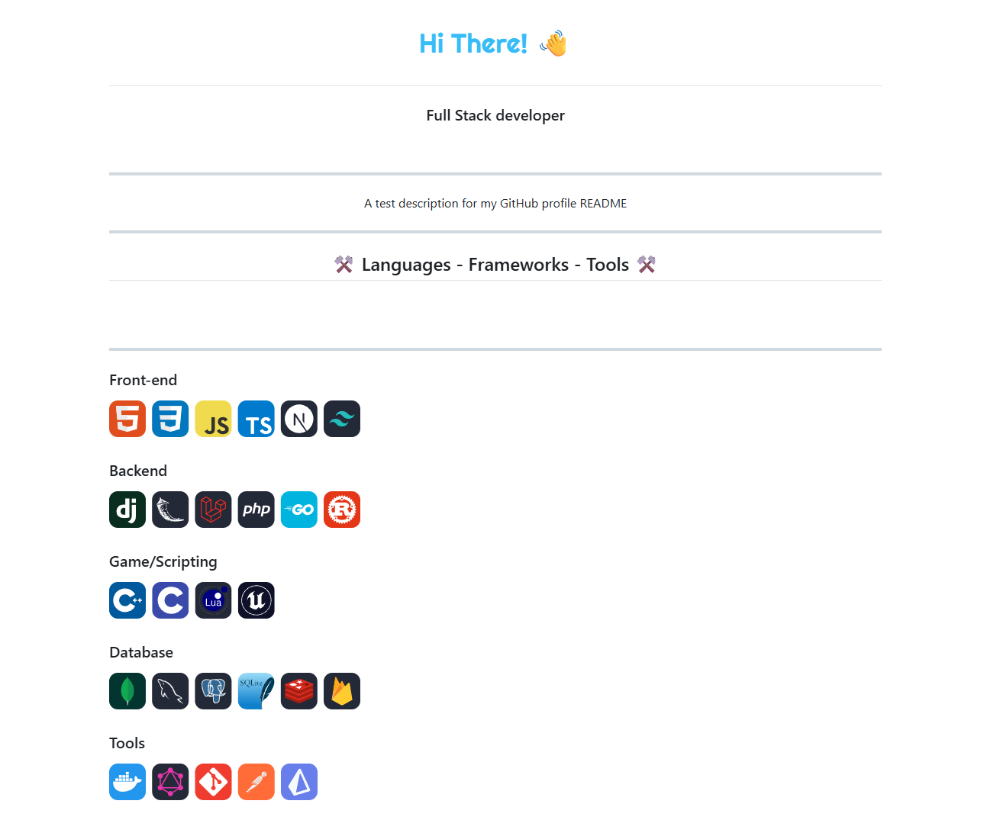

# GitHub README Creator

Create a polished GitHub profile README in a few clicks. Fill in your name, role, description and favorite technologies, then copy or download the generated Markdown.



## Highlights

- Live README preview while you type.
- Technology picker grouped by front-end, back-end, game/scripting, database and tools.
- Skill icons powered by `skillicons.dev`.
- One-click copy and Markdown download.
- Static HTML app, ready for GitHub Pages.

## Live Demo

After publishing with GitHub Pages, your site will be available at:

```text
https://YOUR_USERNAME.github.io/github-readme/
```

Replace `YOUR_USERNAME` with your GitHub username. If you rename the repository, replace `github-readme` with the new repository name.

## Run Locally

Open [index.html](index.html) directly in your browser. No install step is required.

## Publish On GitHub

1. Create a new public repository on GitHub, for example `github-readme`.
2. Push this folder to the repository.
3. Go to `Settings` > `Pages`.
4. Set `Source` to `GitHub Actions`.
5. The included workflow will publish the site automatically after every push to `main`.

## Use It For Your GitHub Profile

To show a custom README on your GitHub profile:

1. Create a public repository with the exact same name as your GitHub username.
2. Use this app to generate your Markdown.
3. Put the generated content in that profile repository's `README.md`.
4. Commit and push it.

## Project Structure

```text
.
|-- github.png
|-- index.html
`-- README.md
```

## Notes

This project is fully static and uses CDN assets for Tailwind CSS, Lenis, Inter and generated skill icons. An internet connection is required for the full visual experience.